# Alumet Payment Control Tower BPMN Swimlane

This document describes the current operating flow implemented in the application after Phase 1 workflow alignment.

## Visual Workflow


Reference file:
- [mvp-workflow-swimlane.svg](/c:/xampp/htdocs/Alumet/alumet-payment-control/docs/assets/mvp-workflow-swimlane.svg)

## Roles / Swimlanes

- `Maker / Finance Staff`
- `Checker / Finance Review`
- `Approver / Executive`
- `Finance Manager`
- `System`

## Swimlane Diagram

```mermaid
flowchart LR
    subgraph Maker["Maker / Finance Staff"]
        M1[Import SAP AP invoices]
        M2[Review unpaid AP invoices by vendor]
        M3[Create Payment Request]
        M4[Upload PO / GRPO / Invoice]
        M5[Complete accounting review checklist]
        M6[Resubmit after correction]
    end

    subgraph Checker["Checker / Finance Review"]
        C1[Open Approval Queue]
        C2[Review finance readiness]
        C3{Complete and correct?}
        C4[Send for management approval]
        C5[Return for correction]
        C6[Reject request]
    end

    subgraph Approver["Approver / Executive"]
        A1[Open Approval Queue]
        A2[Review request and supporting documents]
        A3{Approve?}
        A4[Approve for payment]
        A5[Return for correction]
        A6[Reject request]
    end

    subgraph Finance["Finance Manager"]
        F1[Create payment batch]
        F2[Prepare cheque or payment execution]
        F3[Upload payment proof]
        F4[Capture payment date and reference]
        F5[Mark as Paid]
        F6[Review reports and calendar]
    end

    subgraph System["System"]
        S1[Store SAP AP invoice and vendor data]
        S2[Set Payment Request status = Pending Documents]
        S3[Set status = Pending Accounting Review]
        S4[Set status = Pending Finance Review]
        S5[Create approval tasks from approval matrix]
        S6[Set status = Pending Management Approval]
        S7[Set status = Approved for Payment]
        S8[Set status = Returned for Correction]
        S9[Set status = Rejected]
        S10[Set status = Paid]
        S11[Update linked AP invoice payment status]
        S12[Write audit logs]
    end

    M1 --> S1
    S1 --> M2
    M2 --> M3
    M3 --> S2
    S2 --> M4
    M4 --> M5
    M5 --> S3
    S3 --> S4
    S4 --> C1

    C1 --> C2
    C2 --> C3
    C3 -- Yes --> C4
    C3 -- Return --> C5
    C3 -- Reject --> C6
    C4 --> S5
    S5 --> S6
    C5 --> S8
    C6 --> S9

    S6 --> A1
    A1 --> A2
    A2 --> A3
    A3 -- Approve --> A4
    A3 -- Return --> A5
    A3 -- Reject --> A6
    A4 --> S7
    A5 --> S8
    A6 --> S9

    S8 --> M6
    M6 --> S2

    S7 --> F1
    F1 --> F2
    F2 --> F3
    F3 --> F4
    F4 --> F5
    F5 --> S10
    S10 --> S11
    S11 --> F6

    M3 -.-> S12
    M5 -.-> S12
    C4 -.-> S12
    C5 -.-> S12
    C6 -.-> S12
    A4 -.-> S12
    A5 -.-> S12
    A6 -.-> S12
    F5 -.-> S12
```



## Status Lifecycle

```text
Unpaid AP Invoice
  -> Payment Request created
  -> Pending Documents
  -> Pending Accounting Review
  -> Pending Finance Review
  -> Pending Management Approval
  -> Approved for Payment
  -> Paid

Alternative branch:
Pending Finance Review / Pending Management Approval
  -> Returned for Correction
  -> Pending Documents or Pending Accounting Review

Alternative branch:
Pending Finance Review / Pending Management Approval
  -> Rejected
```

## Notes About Current System Rules

- One Payment Request should contain AP invoices from one vendor only.
- Unpaid AP invoices are selected from the SAP import with outstanding balance greater than zero.
- When a Payment Request is created, linked AP invoices are moved to `Pending Documents`.
- A request cannot move past accounting review if required documents are missing.
- If WHT is applicable, WHT base amount and WHT amount must be filled.
- A request can be returned for correction with a required return reason and target.
- Finance Manager can create payment batches from `Approved for Payment` requests.
- A request cannot be marked `Paid` unless payment details and `Payment Proof` are present.
- When a Payment Request is marked `Paid`, linked SAP AP invoices are updated to `Paid`.
