# Alumet Payment Control Tower BPMN Swimlane

This document describes the current operating flow implemented in the application.

## Roles / Swimlanes

- `Maker / Finance Staff`
- `Checker`
- `Approver / Executive`
- `Finance Manager`
- `System`

## Swimlane Diagram

```mermaid
flowchart LR
    subgraph Maker["Maker / Finance Staff"]
        M1[Import SAP AP invoices]
        M2[Review unpaid AP invoices by vendor]
        M3[Create Payment Request]
        M4[Attach supporting documents]
    end

    subgraph Checker["Checker"]
        C1[Open Approval Queue]
        C2[Review Payment Request]
        C3{Information correct?}
        C4[Pass to Approver]
        C5[Reject request]
    end

    subgraph Approver["Approver / Executive"]
        A1[Open Approval Queue]
        A2[Review request and invoice references]
        A3{Approve?}
        A4[Approve request]
        A5[Reject request]
    end

    subgraph Finance["Finance Manager"]
        F1[Review approved requests]
        F2[Mark Ready to Pay]
        F3[Create payment batch]
        F4[Prepare cheque or payment execution]
        F5[Mark as Paid]
        F6[Review reports and calendar]
    end

    subgraph System["System"]
        S1[Store SAP AP invoice and vendor data]
        S2[Set Payment Request status = Waiting Check]
        S3[Create approval tasks from approval matrix]
        S4[Set status = Waiting Approval]
        S5[Set status = Approved]
        S6[Set status = Rejected]
        S7[Set status = Ready to Pay]
        S8[Set status = Paid]
        S9[Update linked AP invoice payment status]
        S10[Write audit logs]
    end

    M1 --> S1
    S1 --> M2
    M2 --> M3
    M3 --> M4
    M4 --> S2
    S2 --> S3
    S3 --> C1

    C1 --> C2
    C2 --> C3
    C3 -- Yes --> C4
    C3 -- No --> C5
    C4 --> S4
    C5 --> S6

    S4 --> A1
    A1 --> A2
    A2 --> A3
    A3 -- Yes --> A4
    A3 -- No --> A5
    A4 --> S5
    A5 --> S6

    S5 --> F1
    F1 --> F2
    F2 --> S7
    S7 --> F3
    F3 --> F4
    F4 --> F5
    F5 --> S8
    S8 --> S9
    S9 --> F6

    M3 -.-> S10
    C4 -.-> S10
    C5 -.-> S10
    A4 -.-> S10
    A5 -.-> S10
    F5 -.-> S10
```



## Status Lifecycle

```text
Unpaid AP Invoice
  -> Payment Request created
  -> Waiting Check
  -> Waiting Approval
  -> Approved
  -> Ready to Pay
  -> Paid

Alternative branch:
Waiting Check / Waiting Approval
  -> Rejected
```

## Notes About Current System Rules

- One Payment Request should contain AP invoices from one vendor only.
- Unpaid AP invoices are selected from the SAP import with outstanding balance greater than zero.
- When a Payment Request is created, linked AP invoices are moved to `Waiting Check`.
- When a Payment Request is marked `Paid`, linked SAP AP invoices are updated to `Paid`.
- Approval routing is generated from the `approval_matrix`.
- Finance Manager can create payment batches from `Ready to Pay` requests.

