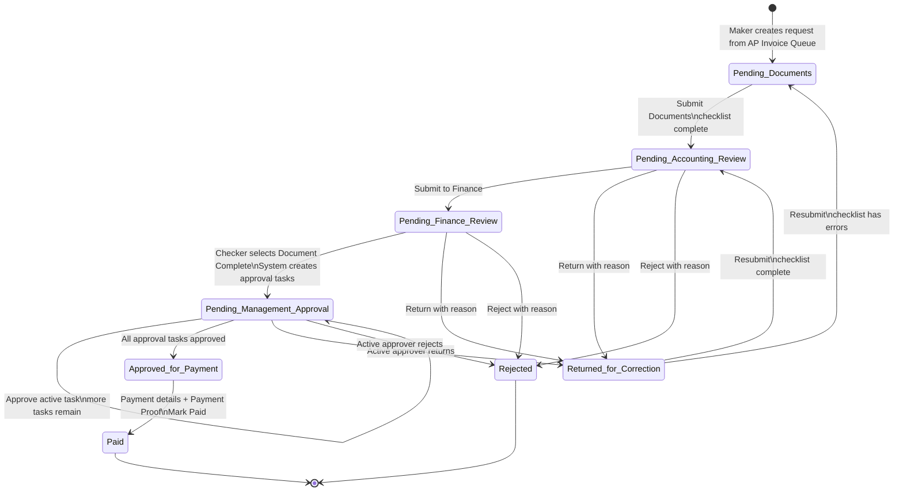

# AP Payment Control Workflow — Program Source of Truth

เอกสารนี้อธิบาย workflow ที่เกิดขึ้นจริงในโปรแกรม ณ วันที่ 16 กันยายน 2026 โดยยึด transition handlers ใน `modules/payment_requests/detail.php` เป็น **Source of Truth** และใช้ชื่อสถานะเดียวกับฐานข้อมูล/หน้าจอทุกตัว

ภาพที่ใช้งานในหน้า Workflow:

- [Detailed workflow](assets/mvp-workflow-swimlane.svg)
- [Executive workflow](assets/mvp-workflow-executive-th.svg)

## Canonical state machine

ลำดับหลักแบบย่อ:

`AP Invoice Queue → Pending Documents → Pending Accounting Review → Pending Finance Review → Pending Management Approval → Approved for Payment → Paid`

## Transition contract

| Current state | User action / condition | Responsible role | Next state | Program rule |
|---|---|---|---|---|
| AP Invoice Queue | Create Payment Request | Maker | Pending Documents | เลือก AP Invoice ที่ยังไม่ Paid |
| Pending Documents | Submit Documents | Maker | Pending Accounting Review | Checklist ต้องครบ |
| Pending Accounting Review | Submit to Finance | Maker | Pending Finance Review | Checklist ต้องครบ |
| Pending Finance Review | Document Complete | Checker | Pending Management Approval | PO, Invoice, GR ต้อง Accepted, มีวิธีจ่าย และระบบสร้าง approval tasks |
| Pending Management Approval | Approve active task | ผู้รับมอบหมายตาม matrix | Pending Management Approval | ถ้ายังมี task ลำดับถัดไป สถานะยังไม่เปลี่ยน |
| Pending Management Approval | Approve final active task | ผู้รับมอบหมายตาม matrix | Approved for Payment | เปลี่ยนสถานะเมื่อทุก task อนุมัติครบเท่านั้น |
| Approved for Payment | Mark Paid | Finance Manager | Paid | ต้องมี payment date, reference, bank, payer และ Payment Proof |
| Pending Accounting Review | Return | Maker-stage reviewer | Returned for Correction | ต้องมีเหตุผลและ `return_to` |
| Pending Finance Review | Return | Checker | Returned for Correction | ต้องมีเหตุผลและ `return_to` |
| Pending Management Approval | Return | Active approver | Returned for Correction | ทำได้เฉพาะ active task |
| Returned for Correction | Resubmit | Maker | Pending Documents | เมื่อ checklist ยังมีข้อผิดพลาด |
| Returned for Correction | Resubmit | Maker | Pending Accounting Review | เมื่อ checklist ผ่าน |
| Pending Accounting / Finance / Management | Reject | ผู้รับผิดชอบของขั้นนั้น | Rejected | ต้องมีเหตุผล; เป็นสถานะปลายทาง |

`Admin` และบาง action ของ `Finance Manager` มีสิทธิ์ override ตาม authorization ในโปรแกรม แต่ไม่เปลี่ยนผู้รับผิดชอบหลักของ lane

## Approval matrix และลำดับอนุมัติ

โปรแกรมสร้าง approval tasks เมื่อ Checker เลือก **Document Complete** เท่านั้น และเปิด task ตาม `sequence_no` ทีละลำดับ:

| Amount (THB) | Approval sequence |
|---:|---|
| 0 – 100,000 | Finance Manager |
| 100,000.01 – 500,000 | Finance Manager → Approver |
| 500,000.01 – 2,000,000 | Approver → Executive |
| มากกว่า 2,000,000 | Executive |

ผู้อนุมัติสามารถทำ action ได้เฉพาะ task ที่ active และได้รับมอบหมายให้ตนเอง (ยกเว้น Admin) การอนุมัติ task กลางทางไม่ทำให้คำขอไป `Approved for Payment`

## Payment preparation ไม่ใช่ state gate

- `Payment Batch` เป็นทางเลือก: รับเฉพาะรายการ `Approved for Payment`, มีสถานะ batch `draft → locked` และไม่เปลี่ยนสถานะ Payment Request
- สามารถ `Mark Paid` จาก `Approved for Payment` ได้โดยไม่ต้องสร้าง Payment Batch
- `Cheque Register` เป็นทางเลือกสำหรับรายการ `Approved for Payment`
- Cheque รองรับ `prepared / signed → released / received / cancelled / void` และ `released → received / cancelled / void`; `received`, `cancelled`, `void` เป็นปลายทาง
- การ `Mark Paid` ต้องมีรายละเอียดการจ่ายและเอกสารประเภท `Payment Proof`; จากนั้น AP Invoice ที่เชื่อมโยงจะถูกอัปเดตเป็น `Paid`

## Role ownership

| Role | Main responsibility |
|---|---|
| Maker | สร้างคำขอ, แนบเอกสาร, ส่ง Pending Documents / Pending Accounting Review และแก้ไขรายการที่ถูก Return |
| Checker | ตรวจเอกสารที่ Pending Finance Review และเลือก Save, Document Complete, Return หรือ Reject |
| Finance Manager / Approver / Executive | อนุมัติตาม approval task และลำดับวงเงินที่ได้รับมอบหมาย |
| Finance Manager | เตรียมการจ่าย, บันทึกหลักฐาน และ Mark Paid |
| Admin | ดูแลระบบและ override action ตามสิทธิ์ที่โปรแกรมกำหนด |

## Diagram rules

- ลูกศรสีม่วงคือ happy path และต้องชี้จาก state ปัจจุบันไป state ถัดไป
- ลูกศรสีส้มคือ Return / Resubmit
- ลูกศรสีแดงคือ Reject และต้องจบที่ `Rejected`
- เส้นวนใน Approval แปลว่า “อนุมัติ task ปัจจุบันแล้ว แต่ยังมี task ถัดไป” ไม่ใช่การข้ามผู้อนุมัติ
- ภาพทั้งสองต้องอัปเดตพร้อม transition contract นี้ทุกครั้งที่ handler ในโปรแกรมเปลี่ยน

## Implementation references

- State transitions and validations: `modules/payment_requests/detail.php`
- Request creation: `modules/payment_requests/create.php`
- Approval task generation / matrix: approval helpers and seeded approval matrix used by Payment Requests
- Payment batch: `modules/payment_batches/`
- Cheque register: cheque management module
- Role authorization: `config/auth.php`
