# Alumet Payment Control Tower
## BPMN Swimlane Workflow For Team Discussion

This version is prepared for business discussion with Procurement, Accounting, Finance, and Management.

## Visual Workflow

Open the swimlane image directly from the project:


Reference file:
- [mvp-workflow-swimlane.svg](/c:/xampp/htdocs/Alumet/alumet-payment-control/docs/assets/mvp-workflow-swimlane.svg)
- [mvp-workflow-executive-th.svg](/c:/xampp/htdocs/Alumet/alumet-payment-control/docs/assets/mvp-workflow-executive-th.svg)

## 1. Objective

Use this workflow to align on:

- who is responsible in each step
- which documents are mandatory
- where a request can be returned for correction
- when approval is required
- when payment can be executed and closed

## 2. Proposed Swimlanes

- `Procurement`
- `Accounting / AP`
- `Finance Review`
- `Management Approver`
- `Finance Payment`
- `System`

## 3. End-to-End Workflow

```mermaid
flowchart LR
    subgraph P["Procurement"]
        P1[Prepare PO]
        P2[Prepare GRN or GRPO]
        P3[Receive Vendor Invoice]
        P4[Upload or hand over supporting documents]
        P5[Correct missing or incorrect documents]
    end

    subgraph A["Accounting / AP"]
        A1[Select unpaid SAP AP invoices]
        A2[Create Payment Request]
        A3[Check vendor and invoice grouping]
        A4[Verify 3-way match PO GRN Invoice]
        A5[Review tax invoice requirement]
        A6[Calculate WHT gross and net payable]
        A7{Documents and accounting data complete?}
        A8[Submit to Finance Review]
        A9[Revise accounting data]
    end

    subgraph F["Finance Review"]
        F1[Review due date payment method and cash readiness]
        F2{Ready for approval?}
        F3[Send to Management Approval]
        F4[Return for correction]
        F5[Reject request]
    end

    subgraph M["Management Approver"]
        M1[Review amount purpose and supporting documents]
        M2{Approve?}
        M3[Approve for Payment]
        M4[Return for correction]
        M5[Reject request]
    end

    subgraph FP["Finance Payment"]
        FP1[Create payment batch]
        FP2[Prepare cheque or bank transfer]
        FP3[Execute payment]
        FP4[Upload payment proof]
        FP5[Record payment reference bank payer and payment date]
        FP6[Close request as Paid]
    end

    subgraph S["System"]
        S1[Create Payment Request status Pending Documents]
        S2[Set status Pending Accounting Review]
        S3[Set status Pending Finance Review]
        S4[Create approval tasks from approval matrix]
        S5[Set status Pending Management Approval]
        S6[Set status Returned for Correction]
        S7[Set status Rejected]
        S8[Set status Approved for Payment]
        S9[Set status Paid]
        S10[Update SAP invoice payment status]
        S11[Write audit trail]
    end

    P1 --> P2 --> P3 --> P4
    P4 --> A1
    A1 --> A2 --> A3 --> A4 --> A5 --> A6 --> A7
    A2 --> S1
    A7 -- Yes --> A8
    A8 --> S2
    S2 --> S3
    S3 --> F1

    A7 -- No --> A9
    A9 --> S6
    S6 --> P5
    P5 --> P4

    F1 --> F2
    F2 -- Yes --> F3
    F3 --> S4
    S4 --> S5
    S5 --> M1
    F2 -- Return --> F4
    F4 --> S6
    F2 -- Reject --> F5
    F5 --> S7

    M1 --> M2
    M2 -- Approve --> M3
    M3 --> S8
    M2 -- Return --> M4
    M4 --> S6
    M2 -- Reject --> M5
    M5 --> S7

    S8 --> FP1 --> FP2 --> FP3 --> FP4 --> FP5 --> FP6
    FP6 --> S9
    S9 --> S10

    A2 -.-> S11
    A8 -.-> S11
    F3 -.-> S11
    F4 -.-> S11
    F5 -.-> S11
    M3 -.-> S11
    M4 -.-> S11
    M5 -.-> S11
    FP6 -.-> S11
```



## 4. Status Lifecycle

```text
Pending Documents
-> Pending Accounting Review
-> Pending Finance Review
-> Pending Management Approval
-> Approved for Payment
-> Paid

Alternative:
Pending Finance Review or Pending Management Approval
-> Returned for Correction
-> Pending Documents or Pending Accounting Review

Alternative:
Pending Finance Review or Pending Management Approval
-> Rejected
```

## 5. Mandatory Documents

- `PO`
- `GRN / GRPO`
- `Vendor Invoice`
- `Tax Invoice` when tax invoice is required
- `Payment Proof` before closing as `Paid`

## 6. Key Control Points

- One Payment Request should contain invoices from one vendor only.
- Accounting should complete 3-way match before sending to Finance Review.
- If WHT is applicable, the request must include:
  - WHT applicable flag
  - WHT rate
  - WHT base amount
  - WHT amount
- Finance cannot send the request to approval if mandatory documents are missing.
- Management approval should follow the approval matrix by amount.
- Finance should not mark the request as `Paid` without payment date, payment reference, bank or channel, payer name, and payment proof.

## 7. Discussion Questions For Team Workshop

Use these questions during the meeting:

1. Should Procurement upload documents directly in the system, or should Accounting upload after receiving them?
2. Is `Pending Documents` owned by Procurement or by Accounting?
3. At what amount thresholds should Management approval be required?
4. Should Finance Manager be allowed to approve in place of Management in specific cases?
5. What are the exact return reasons that should become standard options?
6. Which payment methods are allowed in MVP:
   - cheque
   - bank transfer
   - cash
7. Should one PR allow multiple invoices for one vendor only, or also one invoice per PR in some scenarios?
8. Do we need a separate step for tax validation before Finance Review?

## 8. Suggested Meeting Output

At the end of the workshop, the team should agree on:

- final swimlanes and role ownership
- final mandatory document list
- return and reject rules
- approval thresholds
- payment completion evidence required
- scope changes for next MVP phase
