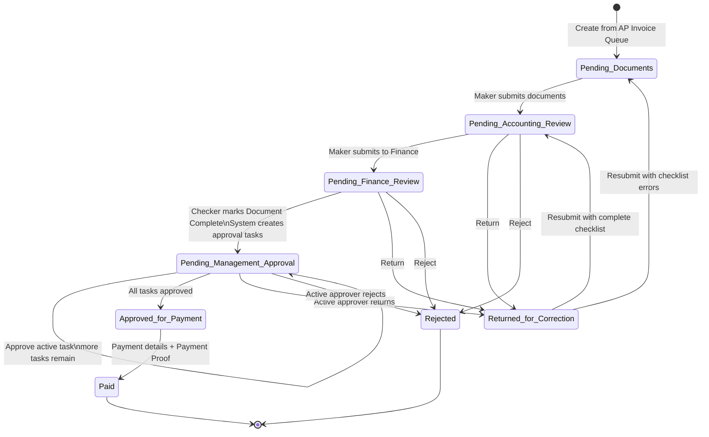

# AP Payment Control — Team Workflow Discussion

เอกสารสำหรับทบทวนร่วมกันโดยใช้ state machine ชุดเดียวกับโปรแกรม ไม่สร้าง business flow แยกจากระบบ

> **Source of Truth:** transition handlers ใน `modules/payment_requests/detail.php`
>
> **Canonical specification:** [BPMN_Swimlane.md](BPMN_Swimlane.md)
>
> **Visuals:** [Detailed workflow](assets/mvp-workflow-swimlane.svg) และ [Executive workflow](assets/mvp-workflow-executive-th.svg)

## State machine ที่ใช้ในการประชุม

## Ownership by stage

| Stage | Owner | Entry state | Exit state / result |
|---|---|---|---|
| Create and prepare | Maker | AP Invoice Queue | Pending Documents |
| Submit documents | Maker | Pending Documents | Pending Accounting Review |
| Submit to Finance | Maker | Pending Accounting Review | Pending Finance Review |
| Document validation | Checker | Pending Finance Review | Pending Management Approval, Returned for Correction หรือ Rejected |
| Sequential approval | Assigned Finance Manager / Approver / Executive | Pending Management Approval | task ถัดไป, Approved for Payment, Returned for Correction หรือ Rejected |
| Payment execution | Finance Manager | Approved for Payment | Paid |
| Correction | Maker | Returned for Correction | Pending Documents หรือ Pending Accounting Review |

## Control points ที่ทีมต้องยืนยัน

1. **Separation of Duties** — Maker เตรียมรายการ, Checker ตรวจเอกสาร, ผู้อนุมัติทำงานตาม task, Finance Manager ปิดการจ่าย
2. **Document gate** — Checker เลือก Document Complete ได้เมื่อ PO, Invoice, GR เป็น Accepted มีวิธีจ่าย และ checklist ผ่าน
3. **Sequential approval** — ผู้อนุมัติทำได้เฉพาะ active task; ระบบยังคง `Pending Management Approval` จน task สุดท้ายอนุมัติ
4. **Return behavior** — Return ต้องมีเหตุผล; Maker เป็นผู้แก้และ Resubmit; checklist เป็นตัวกำหนดว่าจะกลับ `Pending Documents` หรือ `Pending Accounting Review`
5. **Reject behavior** — Reject จากขั้น Accounting, Finance Review หรือ active approval จบที่ `Rejected` และไม่เข้าสู่ขั้นจ่าย
6. **Payment evidence** — `Mark Paid` ต้องมี payment date, reference, bank, payer และ `Payment Proof`
7. **Optional preparation** — Payment Batch และ Cheque Register ช่วยเตรียมจ่าย แต่ไม่ใช่ state บังคับก่อน `Paid`
8. **Auditability** — ทุก transition, comment, task decision และการจ่ายต้องตรวจสอบย้อนหลังได้

## Approval route ที่โปรแกรมสร้าง

| Amount (THB) | Sequential approvers |
|---:|---|
| 0 – 100,000 | Finance Manager |
| 100,000.01 – 500,000 | Finance Manager → Approver |
| 500,000.01 – 2,000,000 | Approver → Executive |
| มากกว่า 2,000,000 | Executive |

## Decisions for the team

- ผู้ใช้งานแต่ละ Module ถูก assign เป็น Maker, Checker, Approver, Finance Manager หรือ Executive ถูกต้องหรือไม่
- `return_to` ที่หน้าจอให้เลือกสอดคล้องกับเจ้าของงานจริงหรือควรจำกัดให้ตรง role มากขึ้น
- ต้องเพิ่ม transition เข้าสู่ cheque status `signed` ใน UI หรือคงไว้เป็นสถานะรองรับเท่านั้น
- Approval matrix ตามวงเงินข้างต้นตรงกับนโยบายล่าสุดหรือไม่
- ต้องบังคับ Payment Batch สำหรับ payment method บางประเภทในอนาคตหรือไม่ (ปัจจุบันไม่บังคับ)

เมื่อทีมตัดสินใจเปลี่ยน workflow ให้แก้ handler/validation ในโปรแกรมก่อน แล้วอัปเดต [canonical specification](BPMN_Swimlane.md) และ SVG ทั้งสองใน commit เดียวกัน เพื่อไม่ให้เอกสารกับระบบแยกกันอีก
